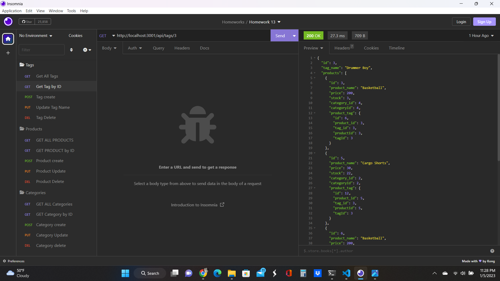
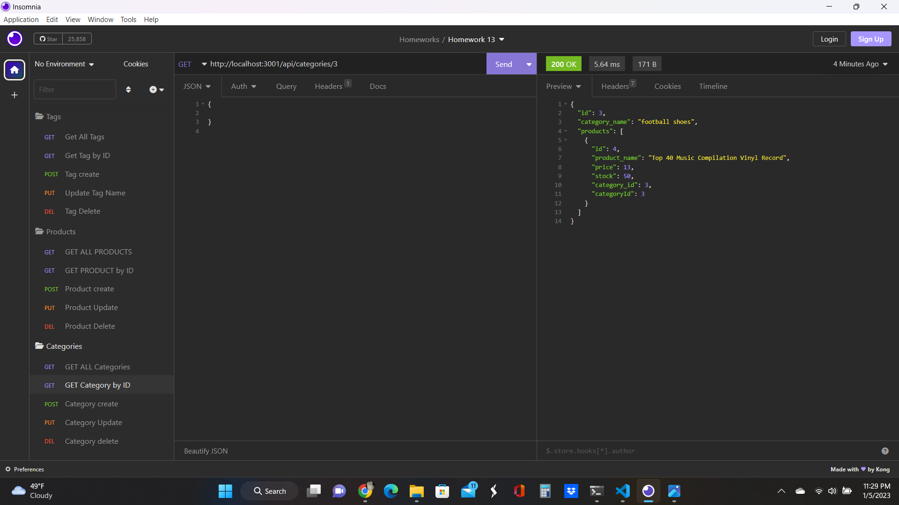
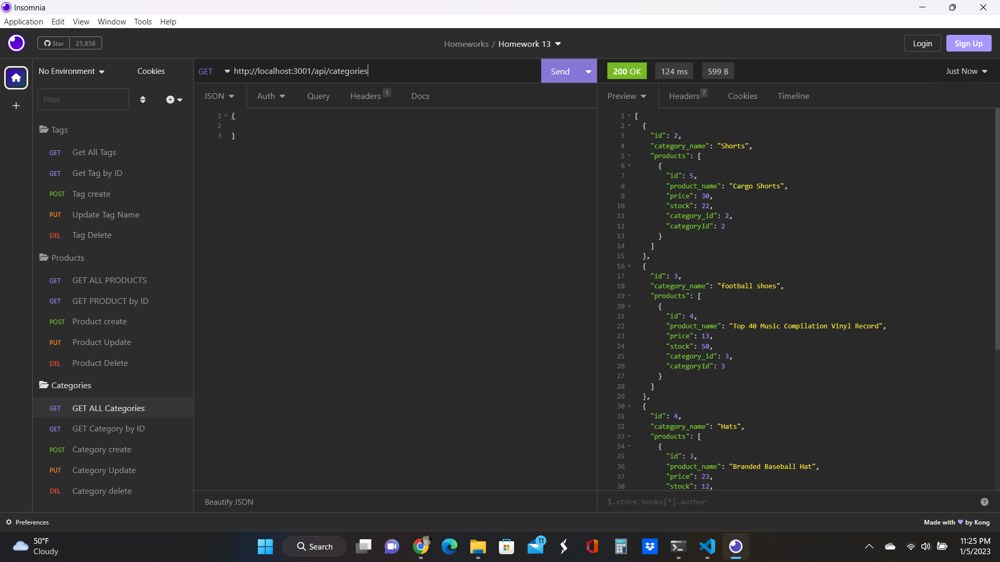

# orm-back-end
## Description

This program creates the models and routes for a sequalize database ecommerce_db. 

- 
- created the get, get by ID, post, put and delete routes for Tags
- created the get, get by ID, post, put and delete routes for Categories
- created the get, get by ID and delete routes for Products
- Filled in the models for Tag, Categories, Products and ProductTags
- Created a read.me

## Screenshot

## Link to Project

[https://github.com/vanwykkim/orm-back-end]

## Credits

UW bootcamp provided initial code for the project

## License

Please refer to the LICENSE in the repo.